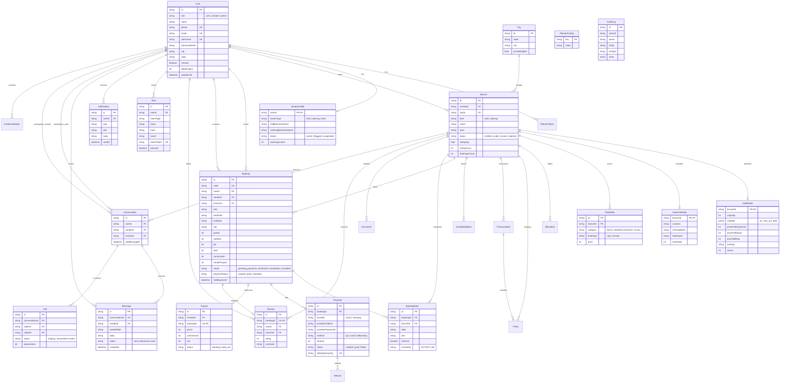

# Entity-Relationship Diagram (ERD)

This document visualizes the complete database schema for Utsavora (29 models) defined in `database/schema.prisma`.

```mermaid
erDiagram
    User ||--o{ RefreshToken : has
    User ||--o| VendorProfile : has
    User ||--o{ Branch : owns
    User ||--o{ Booking : books
    User ||--o{ Booking : receives
    User ||--o{ Review : writes
    User ||--o{ Plan : saves
    User ||--o{ Notification : receives
    User ||--o{ Message : sends
    User ||--o{ Conversation : participates_user
    User ||--o{ Conversation : participates_vendor
    User ||--o{ ContactViolation : commits

    City ||--o{ Branch : locates

    Branch ||--o| HallDetails : specifies
    Branch ||--o| CatererDetails : specifies
    Branch ||--o{ PlateRate : prices
    Branch ||--o{ MenuItem : offers
    Branch ||--o{ Photo : displays
    Branch ||--o{ PreviousWork : showcases
    Branch ||--o{ AvailabilityBlock : blocks
    Branch ||--o{ Booking : hosts
    Branch ||--o{ BookingDate : schedules
    Branch ||--o{ Document : certifies
    Branch ||--o{ Review : receives
    Branch ||--o{ Conversation : attaches

    PreviousWork ||--o{ Photo : includes

    Booking ||--o{ BookingDate : locks
    Booking ||--o{ Payment : bills
    Booking ||--o| Payout : disburses
    Booking ||--o| Review : receives

    Payment ||--o{ Refund : refunds

    Conversation ||--o{ Message : contains
    Conversation ||--o{ Call : conducts

    User {
        string id PK
        string role "user | vendor | admin"
        string name
        string phone UK
        string email UK
        string username UK
        string passwordHash
        string city
        string state
        boolean isActive
        int failedLogins
        datetime lockedUntil
    }

    VendorProfile {
        string userId PK,FK
        string ownerType "hall | catering | both"
        string hallBusinessName
        string cateringBusinessName
        string status "active | flagged | suspended"
        int warningsCount
    }

    City {
        string id PK
        string state
        string city
        float priceMultiplier
    }

    Branch {
        string id PK
        string vendorId FK
        string cityId FK
        string kind "hall | catering"
        string name
        string area
        string status "verified | under_review | rejected"
        float ratingAvg
        int ratingCount
        int bookingsCount
    }

    HallDetails {
        string branchId PK,FK
        int capacity
        string acMode "ac | non_ac | both"
        int priceFullDayNonAc
        int priceFullDayAc
        int priceHalfDay
        string parking
        int rooms
    }

    CatererDetails {
        string branchId PK,FK
        string cuisines
        string servingStyles
        string foodTypes
        int minPlates
    }

    PlateRate {
        string id PK
        string branchId FK
        string category "basic | standard | premium | luxury"
        string foodType "veg | nonveg"
        int price
    }

    Booking {
        string id PK
        string code UK
        string userId FK
        string vendorId FK
        string branchId FK
        string kind
        string startDate
        string endDate
        string slot
        int guests
        int subtotal
        int gst
        int total
        int commission
        int vendorPayout
        string status "pending_payment | confirmed | completed | cancelled"
        string paymentStatus "unpaid | paid | refunded"
        datetime holdExpiresAt
    }

    BookingDate {
        string id PK
        string bookingId FK
        string branchId FK
        string date
        string slot
        boolean isActive
        string activeKey "ACTIVE | null"
    }

    Payment {
        string id PK
        string bookingId FK
        string provider "mock | razorpay"
        string providerOrderId
        string providerPaymentId
        string method "upi | card | netbanking"
        int amount
        string status "created | paid | failed"
        string idempotencyKey UK
    }

    Payout {
        string id PK
        string vendorId FK
        string bookingId UK,FK
        int gross
        int commission
        int net
        string status "pending | paid_out"
    }

    Conversation {
        string id PK
        string userId FK
        string vendorId FK
        string branchId FK
        datetime lastMessageAt
    }

    Message {
        string id PK
        string conversationId FK
        string senderId FK
        string senderRole
        string body
        string status "sent | delivered | read"
        datetime createdAt
    }

    Call {
        string id PK
        string conversationId FK
        string callerId FK
        string calleeId FK
        string status "ringing | connected | ended"
        int durationSec
    }

    Review {
        string id PK
        string bookingId UK,FK
        string userId FK
        string branchId FK
        int rating
        string comment
    }

    Plan {
        string id PK
        string userId FK
        string eventType
        string cityId
        string input
        string result
        string shareToken UK
        boolean isSaved
    }

    PlannerConfig {
        string key PK
        string value
    }

    Notification {
        string id PK
        string userId FK
        string type
        string title
        string body
        datetime readAt
    }

    AuditLog {
        string id PK
        string actorId
        string action
        string entity
        string entityId
        string meta
    }
```
